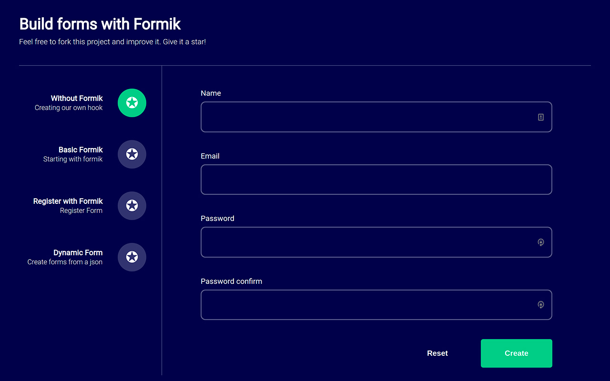
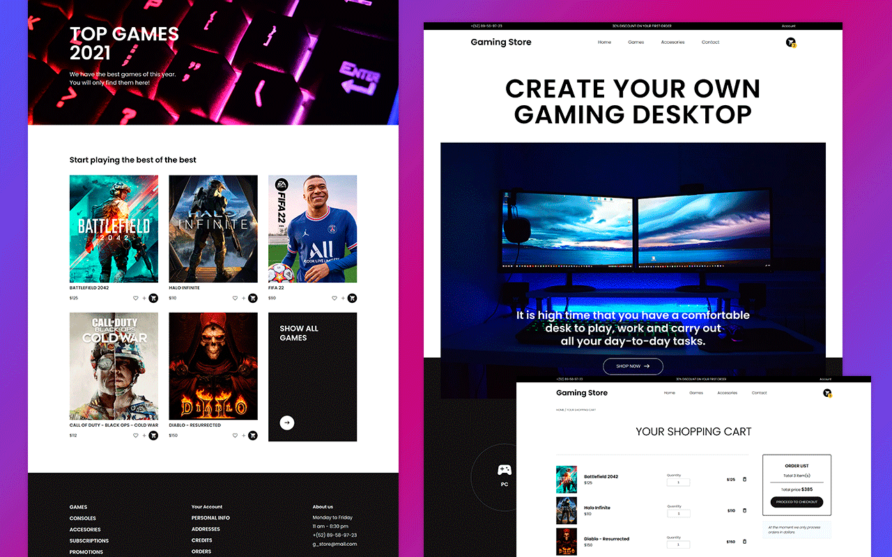
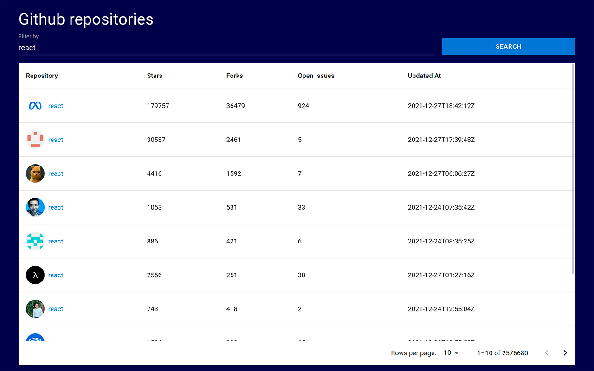

# React Workshops

Repository with exercises from multiple courses and challenges.

The objective is to know the best practices for programming with react and javascript libraries.

# Projects

- **Webpack starter kit**
  - Boilerplate to start a custom react project by setting webpack from 0.
- **Game Store**
  - Creation of an online store using react.
- **Test driven development**
  - Creating an authentication application with a call to the github api, using forms and with the practice of tdd.
- **Custom Forms**
  - Creation of forms from scratch, using hooks, formik, dynamics. Validations with yup.
- **Advanced Patterns**
  - Creating reusable, scalable and maintainable components by implementing advanced patterns in React JS, as well as the SOLID principles behind them.

# License
Released under the  [MIT licensed](LICENSE).\
Feel free to fork this project and improve it. Give a ⭐️ if you like this project!